# ETL Flow

## Current canonical flow

The canonical ETL path is now dbt-first and lives in:

```text
wintap_dbt/
```

Current flow implemented by the code:

```text
raw_sensor parquet, local or S3
  -> wintap_dbt bronze models
  -> wintap_dbt silver models
  -> wintap_dbt gold models
  -> optional wintap_dbt monitoring models
  -> DuckDB analysis database or Spark catalog tables
```

The active dbt profile targets in `wintap_dbt/profiles.yml` are:

| Target | Engine | Current purpose |
| --- | --- | --- |
| `dev` | DuckDB | Local raw Parquet to a local DuckDB database. |
| `duckdb_s3` | DuckDB | S3 raw Parquet to local DuckDB; requires local S3 credentials. |
| `spark` | dbt-spark session/Spark Connect | S3 raw Parquet to Spark catalog tables. Default endpoint is controlled by `SPARK_REMOTE`. |
| `ilum` | dbt-spark Thrift/Kyuubi | Alternate/future Ilum SQL gateway path. |

Materialization defaults in `wintap_dbt/dbt_project.yml` are:

| Layer | Default materialization |
| --- | --- |
| Bronze | `view` |
| Silver | `table` |
| Gold | `table` |
| Monitoring | `view`, enabled by `WINTAP_DBT_INCLUDE_MONITORING` |

## Current validated paths

### Local DuckDB

Local raw Parquet from:

```text
/Users/johnson30/data/lintap/deb-pkg/parquet/raw_sensor
```

was tested with target `dev` and date range `20260530` through `20260601`.

Result:

- `dbt debug --target dev` passed.
- `dbt run --target dev` passed for all 33 models.
- `dbt build --target dev` built models but failed two QA tests because file/network raw rows contain forbidden/sentinel PID hash values. This is a known data-quality issue, not a model-build failure.

### Spark/S3 POC

Current Spark/S3 POC input:

```text
s3a://ilum-data/lintap/raw_sensor
```

Current Spark Connect default in code:

```text
SPARK_REMOTE=sc://spark.acme.dev:15002
```

The POC model:

```text
wintap_dbt/models/bronze/poc_s3_raw_process.sql
```

materializes successfully and proves that dbt can read S3 raw Parquet through Spark and write a Spark table. The next Spark step is staged validation of all available Bronze/Silver/Gold dbt models. See:

```text
wintap_dbt/STATUS_AND_NEXT_STEPS.md
review-notes/PipelineRunbook.md
```

## Canonical raw input

The dbt project expects the dataset variable to point to the parent of `raw_sensor`:

```text
WINTAP_DBT_DATASET=/path/to/parquet
WINTAP_DBT_DATASET=s3a://bucket/prefix
```

The path macros also tolerate being given the `raw_sensor` directory directly.

Canonical layout:

```text
<dataset>/raw_sensor/<event_type>/dayPK=YYYYMMDD/hourPK=HH/*.parquet
<dataset>/raw_sensor/raw_process_conn_incr/dayPK=YYYYMMDD/hourPK=HH/protoPK=tcp|udp/*.parquet
```

Current raw event families represented in dbt bronze:

- `raw_host`
- `raw_macip`
- `raw_process`
- `raw_process_conn_incr`
- `raw_process_file`
- `raw_process_registry`
- `raw_imageload`
- optional pidstat CSV input via `stg_pidstat_metrics`

For partial Spark/S3 datasets, set the event allow-list so missing optional event families can use typed empty fallbacks where implemented:

```sh
export WINTAP_DBT_AVAILABLE_RAW_EVENTS=raw_host,raw_process,raw_macip,raw_process_conn_incr,raw_process_file
```

## Implemented dbt model graph

This diagram reflects the current dbt model files and `ref()` relationships in code.

```mermaid
graph TD
    subgraph Bronze[Bronze raw compatibility]
        raw_host --> stg_raw_host
        raw_macip --> stg_raw_macip
        raw_process --> stg_raw_process
        raw_process_conn_incr --> stg_raw_process_conn_incr
        raw_process_file --> stg_raw_process_file
        raw_process_registry --> stg_raw_process_registry
        raw_imageload --> stg_raw_imageload
        pidstat_csv[pidstat CSV files] --> stg_pidstat_metrics
        raw_process --> poc_s3_raw_process
    end

    subgraph Silver[Silver detail / standard views]
        stg_raw_host --> host
        stg_raw_macip --> host_ip
        stg_raw_process --> process
        stg_raw_process_conn_incr --> process_conn_incr
        process_conn_incr --> process_net_conn
        stg_raw_process_file --> process_file
        stg_raw_process_registry --> process_registry
        stg_raw_imageload --> process_image_load
        stg_pidstat_metrics --> pidstat_metrics
        process --> process_exe_file_summary
        process_exe_file_summary --> files_tmp_v1
        process_image_load --> files_tmp_v1
        process_file --> files_tmp_v1
        files_tmp_v1 --> files
        files --> all_files
        process --> process_path
    end

    subgraph Gold[Gold process summaries]
        process_registry --> process_registry_summary
        process_file --> process_file_summary
        process_net_conn --> process_net_summary
        process_image_load --> process_image_load_summary
        process --> process_summary
        host --> process_summary
        process_registry_summary --> process_summary
        process_file_summary --> process_summary
        process_net_summary --> process_summary
        process_image_load_summary --> process_summary
        process_summary --> process_uber_summary
    end

    subgraph Enrichment[Enrichment stubs]
        labels_graph_process_summary --> process_uber_summary
        process_lolbas_summary --> process_uber_summary
        process_mitre_summary --> process_uber_summary
        sigma_labels_summary --> process_uber_summary
    end

    subgraph Monitoring[Optional monitoring]
        process --> process_chart
        stg_raw_process_file --> file_chart
        stg_raw_process_conn_incr --> network_chart
        pidstat_metrics --> perf_chart
        process --> telemetry_event_summary
        stg_raw_process_file --> telemetry_event_summary
        stg_raw_process_conn_incr --> telemetry_event_summary
        pidstat_metrics --> telemetry_event_summary
        telemetry_event_summary --> build_summary
        host --> build_summary
        host_ip --> build_summary
        process --> build_summary
        process_conn_incr --> build_summary
        process_net_conn --> build_summary
        process_file --> build_summary
        process_registry --> build_summary
        process_image_load --> build_summary
        process_path --> build_summary
        process_summary --> build_summary
        process_uber_summary --> build_summary
    end
```



## Historical ETL level mapping

| Program | Aggregation Level | Hosts/file | Timespan/file | Timestamp | Type | ETL |
| --- | --- | --- | --- | --- | --- | --- |
| Wintap | ProgramData | 1 | 1 minute | win32 | none | sensor output |
| MergeHelper | raw_sensor | 1 | 5 minute | win32 | none | canonical raw materialization |
| Python/SQL | raw | N | <=24 HR | unix | none | legacy/reference; maps to dbt bronze |
| Python/SQL | rolling | N | <=24 HR | unix | aggregation per event type, process unique | legacy/reference; maps to dbt silver |
| Python/SQL | stdview(-X) | N | any/all | unix | aggregation per event type | superseded by dbt silver/gold |

## Historical notes

Raw-to-rolling processing used views on immutable raw files to write tables in the rolling path. MITRE processing was enrichment based on rolling data and was intended to run after rolling data processing for a day completed.

In the dbt-era pipeline, those responsibilities move into dbt model layers:

- historical raw views -> dbt bronze;
- rolling/stdview detail tables -> dbt silver;
- enrichment and process summaries -> dbt gold.

Late-arriving sensor data or enrichment-source updates still require a reprocessing policy. That remains delayed work.

Views versus tables in `rawutil.init_db()`: the historical `raw` path was read-only except for adding more sensor files. All sensor raw data was treated as immutable.

The historical `rolling` path was raw data transformed/aggregated/enriched into a standard base data model for analysts. Rolling was partitioned by day, with the intent that once a full day of raw had been collected, all processing could occur to produce that day's cooked result.

SQL style note: the `AS <column name>` clause is only required when changing a column name. Either explicit or implicit aliases are acceptable, but dbt models should favor readability and cross-engine compatibility.

## Known delayed issues

These are intentionally not hidden by the diagram:

- Full Spark graph validation is still in progress.
- Some Silver/Gold models still contain `group by all` and may need Spark-safe rewrites.
- `process_path` uses recursive/list-style logic and needs explicit Spark validation.
- The current S3 sample does not include registry or image-load raw folders.
- Label/Sigma/MITRE/LOLBAS inputs are typed empty stubs until real enrichment loading is wired in.
- Local DuckDB reads from protected S3 buckets require local S3 credentials.
- `dbt build` can fail QA tests when raw file/network data contains forbidden/sentinel PID hash values; this reflects data quality, not necessarily model build failure.
