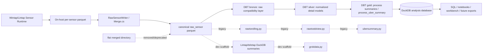

# Architecture: Current ETL Map

## Current architectural stance

DBT is now the **primary canonical ETL path** for Wintap/Lintap post-processing.

The intended flow is:

```text
sensor raw_sensor parquet -> Wintap-PyUtil/wintap_dbt -> DuckDB analysis database -> notebooks / SQL / future parquet export
```

Older Python ETL commands and TeleTap scripts remain useful as historical reference, compatibility tooling, or focused development utilities, but they should be treated as **legacy** unless explicitly revived.

## Repository roles

### `wintap/`

Primary .NET codebase for the Wintap family of sensors and runtime services.

Relevant pieces for the parquet-to-analysis flow:

- `wintap/wintap/core/etl/extract/Serializer.cs`
  - Receives ETL/Esper output events, batches them, and sends batches to the parquet writer.
  - Splits mixed default-serializer messages by `MessageType` so each parquet output has a stable schema.
- `wintap/wintap/core/etl/load/ParquetWriter.cs`
  - Writes sensor batches to on-host parquet files.
- `wintap/wintap/core/etl/load/Merge.cs`
  - Consolidates per-sensor parquet files and materializes them through `RawSensorWriter`.
- `wintap/wintap/core/etl/load/RawSensorWriter.cs`
  - Writes directly to the downstream `raw_sensor` layout:
    - `parquet/raw_sensor/<event_type>/dayPK=YYYYMMDD/hourPK=HH/[protoPK=tcp|udp]/file.parquet`.
  - Keeps limited defensive event-name mappings where explicitly implemented, but network protocol partitions should be canonical `protoPK`.
- `wintap/wintap/core/etl/extract/HostSerializer.cs`
  - Now writes host metadata source folders as `host` and `macip`, producing canonical `raw_host` and `raw_macip` after materialization.
- `wintap/wintap/core/infrastructure/Program.cs`
  - Startup preserves ASP.NET lifetime messages and adds visible parquet/raw_sensor data paths.
- `wintap/wintap/Lintap.csproj`
  - Linux build target for the Wintap runtime. Excludes Windows/macOS platform code and includes Linux/eBPF artifacts.
- `wintap/shared/ai/wintap_mcp_server/DuckDBManager.cs`
  - Separate real-time/interactive DuckDB consumer of recently collected parquet for AI/MCP tools. This is adjacent to, but not the primary batch ETL path.

`wintap/` owns collection and raw materialization. It should not own DBT transformations.

### `Wintap-PyUtil/`

Canonical post-processing repository.

Current primary implementation:

- `wintap_dbt/`
  - DBT/DuckDB project for bronze, silver, and gold transformations.
  - Builds from `raw_sensor` parquet into a DuckDB database.
  - Handles source drift in the bronze layer.
  - Provides basic tests and `build_summary` row-count monitoring.

Supporting project infrastructure:

- `pyproject.toml`
  - uv project configuration and dependencies, including `dbt-duckdb`.
- `Makefile`
  - uv-based development commands.
  - DBT commands:
    - `make dbt-debug`
    - `make dbt-build`
    - `make dbt-test`
    - `make dbt-docs`
  - Environment-driven DBT config via `WINTAP_DATA_ROOT` and derived `WINTAP_DBT_*` variables.

Legacy Python ETL still present:

- `wintappy/etlutils/rawtorolling.py`
- `wintappy/etlutils/rawtostdview.py`
- `wintappy/etlutils/ubersummary.py`
- `wintappy/datautils/rawtostdview.sql`
- `wintappy/datautils/process_summary.sql`

These files are still useful as source material and compatibility tooling, but DBT is now the primary ETL direction.

### `Lintap/teletap/`

Linux/TeleTap development scaffold.

Current role:

- quick local validation of TeleTap/Lintap output,
- resource/performance visualization,
- historical helper scripts.

It previously contained legacy `merged`-oriented tooling such as `mergedtoraw.py`. That path is no longer canonical and the script has been removed. New sensor output should already be `raw_sensor`, and full ETL should use `Wintap-PyUtil/wintap_dbt`.

### `wintap-analytics/`

Notebook and analysis workspace. It consumes processed outputs, especially:

- DBT-built DuckDB database tables/views,
- future exported `stdview`/gold parquet,
- published ACME4-style standard views.

Relevant pieces:

- `workshop/` — getting-started docs and example SQL over Wintap views.
- `2025-acme4-explore/` — modern notebook project using `uv`; reads published or local standard-view parquet directories into DuckDB views.

Analytics code should not own canonical ETL.

## High-level architecture diagram



## DBT model layers

### Bronze

DBT bronze models own raw schema compatibility:

- scan `raw_sensor` parquet,
- filter by `dayPK` range,
- tolerate optional/missing raw sources,
- normalize source drift such as missing `ProcessArgs`,
- expose typed empty relations for missing registry/image-load data.

### Silver

DBT silver models own normalized detail objects:

- `host`
- `host_ip`
- `process`
- `process_conn_incr`
- `process_net_conn`
- `process_file`
- `process_registry`
- `process_image_load`
- `files`
- `all_files`
- `process_path`

### Gold

DBT gold models own analyst-facing summaries:

- `process_registry_summary`
- `process_file_summary`
- `process_net_summary`
- `process_image_load_summary`
- `process_summary`
- `process_uber_summary`

Optional enrichment inputs are currently typed empty stubs. Wiring label/Sigma/MITRE/LOLBAS sources into DBT remains future work.

## Major component boundaries

- Sensor runtime owns **event collection and raw_sensor parquet materialization**.
- DBT in `Wintap-PyUtil/wintap_dbt` owns **canonical ETL transformations, dependency ordering, and tests**.
- Legacy Python ETL owns **compatibility/reference behavior only** until deprecated or wrapped by DBT.
- Analytics notebooks own **exploratory analysis and modeling**, not canonical ETL.
- `Lintap/teletap` owns **development visualization/scaffolding**, not the main pipeline.

## Current validation state

The DBT path has successfully built:

- ACME4 older Windows raw_sensor sample.
- Current LINTAP Linux raw_sensor sample.

Example manual run:

```sh
cd Wintap-PyUtil

source wintap-run.env
make dbt-build
```

Expected successful result:

```text
Completed successfully
PASS=46 WARN=0 ERROR=0 SKIP=0 NO-OP=0 TOTAL=46
```
