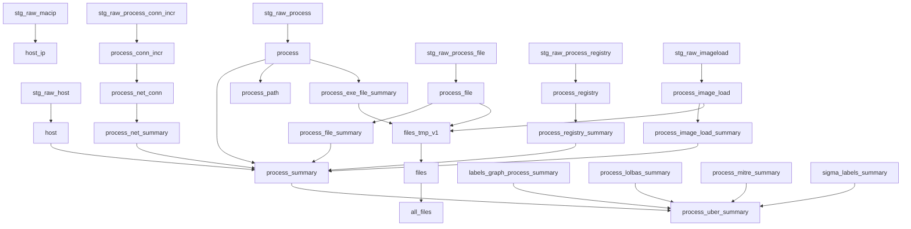

# DBT Model Map

This maps legacy Wintap-PyUtil SQL/Python ETL objects to the implemented DBT model graph.

## Legacy source files used as references

| Legacy file | Role |
| --- | --- |
| `wintappy/datautils/rawutil.py` | Created DuckDB views over parquet, handled schema compatibility, SQL execution, and parquet writing. |
| `wintappy/datautils/rawtostdview.sql` | Built normalized detail tables from raw views. |
| `wintappy/datautils/process_summary.sql` | Built process-level summaries and `process_summary`. |
| `wintappy/datautils/process_path.sql` | Built recursive process paths. |
| `wintappy/datautils/label_summary.sql` | Built graph-label summaries. |
| `wintappy/datautils/lolbas_summary.sql` | Built LOLBAS process summary. |
| `wintappy/datautils/mitre_summary.sql` | Built MITRE summary. |
| `wintappy/datautils/sigma_summary.sql` | Built Sigma summary. |
| `wintappy/datautils/uber_summary.sql` | Built `process_uber_summary`. |

These files are now reference/legacy material. DBT is the primary ETL implementation.

## Bronze models

Bronze models replace Python-generated raw views and absorb raw-source drift.

| DBT model | Raw input | Notes |
| --- | --- | --- |
| `stg_raw_host` | `raw_host` | Reads canonical host metadata. |
| `stg_raw_macip` | `raw_macip` | During transition DBT can also read legacy `raw_macip_sensor`; .NET source now emits canonical `raw_macip`. |
| `stg_raw_process` | `raw_process` | Required; synthesizes missing `ProcessArgs` from `CommandLine` and missing `UniqueProcessKey` as `NULL`. |
| `stg_raw_process_conn_incr` | `raw_process_conn_incr` | Optional but important; new source output should use `protoPK`. |
| `stg_raw_process_file` | `raw_process_file` | File activity. |
| `stg_raw_process_registry` | `raw_process_registry` | Optional; DBT emits an empty typed relation if absent. |
| `stg_raw_imageload` | `raw_imageload` | Optional; DBT emits an empty typed relation if absent. |

## Silver detail models

Silver models are DBT translations of the old standard-detail objects from `rawtostdview.sql` and `process_path.sql`.

| DBT model | Legacy SQL object | Dependencies |
| --- | --- | --- |
| `host` | `host` | `stg_raw_host` |
| `host_ip` | `host_ip` | `stg_raw_macip` |
| `process` | `process` | `stg_raw_process` |
| `process_conn_incr` | `process_conn_incr` | `stg_raw_process_conn_incr` |
| `process_net_conn` | `process_net_conn` | `process_conn_incr` |
| `process_file` | `process_file` | `stg_raw_process_file` |
| `process_registry` | `process_registry` | `stg_raw_process_registry` |
| `process_image_load` | `process_image_load` | `stg_raw_imageload` |
| `process_exe_file_summary` | `process_exe_file_summary` | `process` |
| `files_tmp_v1` | `files_tmp_v1` | `process_exe_file_summary`, `process_image_load`, `process_file` |
| `files` | `files` | `files_tmp_v1` |
| `all_files` | `all_files` | `files` |
| `process_path` | `process_path` | `process` |

Special porting notes:

- Legacy `process` SQL used create/update steps; DBT should keep this as CTE-based select logic.
- Legacy `rawtostdview.py` referenced stale `process_path_2.sql`; DBT uses the `process_path.sql` approach directly.
- If large datasets struggle with `process_path`, consider a wrapper strategy to build per host later.

## Gold summary models

Gold models translate `process_summary.sql`, enrichment summary SQL, and `uber_summary.sql`.

| DBT model | Legacy SQL object | Dependencies |
| --- | --- | --- |
| `process_registry_summary` | `process_registry_summary` | `process_registry` |
| `process_file_summary` | `process_file_summary` | `process_file` |
| `process_net_summary` | `process_net_summary` | `process_net_conn` |
| `process_image_load_summary` | `process_image_load_summary` | `process_image_load` |
| `process_summary` | `process_summary` | `process`, `host`, summary models |
| `labels_graph_process_summary` | `labels_graph_process_summary` | future labels/networkx source; currently typed empty stub |
| `process_lolbas_summary` | `process_lolbas_summary` | future LOLBAS/LOLC source; currently typed empty stub |
| `process_mitre_summary` | `process_mitre_summary` | future MITRE source; currently typed empty stub |
| `sigma_labels_summary` | `sigma_labels_summary` | future Sigma source; currently typed empty stub |
| `process_uber_summary` | `process_uber_summary` | `process_summary`, enrichment summary models |

## Monitoring model

| DBT model | Purpose |
| --- | --- |
| `build_summary` | Row-count monitoring for built DBT relations. |

## DBT DAG sketch

## Legacy pattern to DBT replacement

| Legacy pattern | DBT-era replacement |
| --- | --- |
| Multi-statement SQL files | One model per final relation. |
| `CREATE TABLE AS ...; UPDATE ...; UPDATE ...` | CTE chain and final select. |
| Python-created raw views | DBT bronze models/macros. |
| Required template fallback in `rawutil.py` | DBT typed empty selects for optional registry/image-load and enrichment inputs. |
| Dynamic path globs in Python | DBT vars plus path/raw-source macros. |
| `ru.write_parquet()` | Future DBT external materialization or wrapper export step. |

## Validation approach

For each significant DBT change:

1. Run DBT against known ACME4 and LINTAP sample datasets.
2. Compare row counts in `build_summary`.
3. Compare column names and types for core models.
4. Compare key aggregations, especially by `hostname`, `pid_hash`, and `process_name`.
5. For `process_uber_summary`, assert row count equals `process_summary` unless enrichment join logic intentionally changes.
