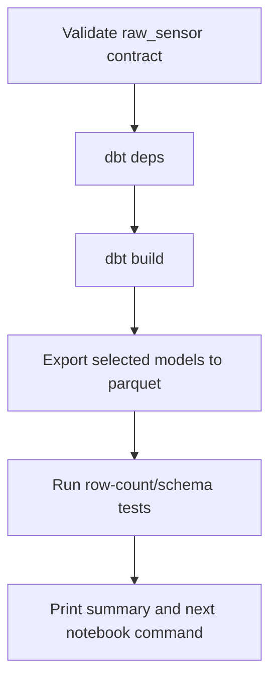

# DBT Pipeline Plan for Wintap/Lintap Data

## Goal

Create one understandable, repeatable full-pipeline process that starts from canonical `raw_sensor` parquet and ends with analysis-ready parquet/DuckDB objects such as `process_summary`, `process_path`, and `process_uber_summary`.

The target user experience should be close to:

```sh
wintap-etl build --dataset /data/acme4 --start 20240819 --end 20240923
```

or, for raw dbt users:

```sh
dbt deps
DBT_PROFILES_DIR=. dbt build --vars '{dataset: /data/acme4, start_day: 20240819, end_day: 20240923}'
```

## Updated assumptions from project guidance

- `merged` is no longer a supported first-class stage.
- Sensor output should be `raw_sensor` directly.
- `mergedtoraw.py` has been removed; new data should already be materialized as `raw_sensor`.
- Canonical raw partition naming should be:

```text
raw_sensor/<event_type>/dayPK=YYYYMMDD/hourPK=HH/[protoPK=tcp|udp]/file.parquet
```

- Timestamp complexity is accepted for now; document rather than block.
- Use `process_path.sql` as the current process-path implementation.
- Image-load naming cleanup is low priority.
- Required empty parquet schema templates should be inventoried.
- Backdated incremental handling is low priority.
- Current dedupe approach is acceptable but needs human confirmation.

## Why DBT fits

The current ETL already has many DBT-shaped properties:

- Most transformations are SQL model definitions.
- The transformation graph is explicit and mostly acyclic.
- DuckDB is the execution engine.
- Outputs are table/view-like datasets consumed by analysts.
- Schema tests and documentation would directly help outsiders.
- The existing medallion layers map naturally to DBT model groups.

DBT should own transformations, dependency ordering, docs, tests, and reproducible builds. It should **not** own sensor collection.

## Proposed pipeline boundary

### In scope for DBT

Input:

```text
<dataset>/raw_sensor/...
```

Current output:

```text
DuckDB database containing DBT bronze/silver/gold/monitoring models
```

Future optional exports may write:

```text
<dataset>/stdview-<start>-<end>/...
<dataset>/gold-<start>-<end>/...
```

Core transforms:

- raw source views over parquet.
- raw schema compatibility shims.
- detail/standard tables.
- daily/incremental models.
- process summaries.
- process paths.
- label/LOLBAS/MITRE/Sigma summaries where inputs exist.

### Out of scope for DBT

- eBPF/ETW collection.
- On-host parquet flushing and rotation.
- Legacy `merged` conversion.
- S3 download orchestration, at least initially. DBT can read S3 via DuckDB/httpfs later, but treating local `raw_sensor` as the v1 contract is cleaner.
- Notebook-specific analysis.

## DBT project location

The DBT project now lives in `Wintap-PyUtil` because that repo owns canonical post-processing.

Path:

```text
Wintap-PyUtil/wintap_dbt/
```

Rationale:

- Keeps canonical ETL and Python helper package together.
- Allows existing CLI/config wrappers to call DBT.
- Avoids coupling DBT to the .NET sensor repo.
- Analytics repos can consume outputs without becoming ETL owners.

## Implemented DBT model layout

```text
wintap_dbt/
  dbt_project.yml
  profiles.yml
  profiles.yml.example
  macros/
    paths.sql
    time.sql
    ip.sql
    raw_sources.sql
    relations.sql
  models/
    schema.yml
    bronze/
      stg_raw_host.sql
      stg_raw_macip.sql
      stg_raw_process.sql
      stg_raw_process_conn_incr.sql
      stg_raw_process_file.sql
      stg_raw_process_registry.sql
      stg_raw_imageload.sql
    silver/
      host.sql
      host_ip.sql
      process.sql
      process_conn_incr.sql
      process_net_conn.sql
      process_file.sql
      process_registry.sql
      process_image_load.sql
      process_exe_file_summary.sql
      files_tmp_v1.sql
      files.sql
      all_files.sql
      process_path.sql
    gold/
      process_registry_summary.sql
      process_file_summary.sql
      process_net_summary.sql
      process_image_load_summary.sql
      process_summary.sql
      labels_graph_process_summary.sql
      process_lolbas_summary.sql
      process_mitre_summary.sql
      sigma_labels_summary.sql
      process_uber_summary.sql
    monitoring/
      build_summary.sql
```

## Model layering

### Bronze: raw parquet compatibility layer

Bronze models should replace `rawutil.create_raw_views()` behavior.

Responsibilities:

- Read raw parquet from canonical `raw_sensor` globs.
- Use Hive partitioning.
- Use `union_by_name=true`.
- Apply day range filters.
- Use canonical partition key names `dayPK`, `hourPK`, `protoPK`; new data is expected to conform.
- Add missing compatibility columns such as `agentid` when absent.
- Recompute/fix `connid` only where the known historical bug applies.
- Deduplicate with current `GROUP BY ALL` strategy and keep or expose `num_dups`.
- Provide empty relations for optional event types when no data exists but downstream models require structure.

Expected bronze model form:

```sql
select ...
from parquet_scan('{{ raw_sensor_glob("raw_process") }}', hive_partitioning=1, union_by_name=true)
where dayPK between {{ var('start_day') }} and {{ var('end_day') }}
group by all
```

### Silver: normalized standard detail tables

Silver models should be one-object-per-file translations of `rawtostdview.sql` and `process_path.sql`:

- `host`
- `host_ip`
- `process`
- `process_conn_incr`
- `process_net_conn`
- `process_file`
- `process_registry`
- `process_image_load`
- `files`
- `all_files`
- `process_path`

Break up the existing multi-statement SQL file into DBT models connected by `ref()`.

Example dependency shift:

```sql
from raw_process
```

becomes:

```sql
from {{ ref('stg_raw_process') }}
```

### Gold: summaries and enrichment

Gold models should translate:

- `process_summary.sql`
- `label_summary.sql`
- `lolbas_summary.sql`
- `mitre_summary.sql`
- `sigma_summary.sql`
- `uber_summary.sql`

Core required gold output:

- `process_summary`
- `process_uber_summary`

Optional enrichment inputs should be handled gracefully. If labels/Sigma/MITRE/LOLBAS inputs do not exist, DBT should create typed empty models so `process_uber_summary` still builds.

## Materialization strategy

### Phase 1: DBT builds into a DuckDB database

Start with the simplest robust implementation:

```text
<dataset>/work/wintap.duckdb
```

- Bronze as `view` where practical.
- Silver/gold as `table` for stability/performance.
- Use DBT docs/tests for discoverability.
- Export parquet in a post-build step or via explicit export command.

This minimizes custom DBT materialization risk.

### Phase 2: Parquet external materialization

After Phase 1 works, evaluate `dbt-duckdb` external materializations for parquet outputs.

Desired published outputs:

```text
<dataset>/rolling/<model>/dayPK=YYYYMMDD/<model>-YYYYMMDD.parquet
<dataset>/stdview-<start>-<end>/<model>.parquet
```

Important validation point: confirm current `dbt-duckdb` support for `materialized='external'`, parquet `location`, and partitioned writes before implementation. If partitioned external materialization is awkward, keep DBT database builds plus a small Python export wrapper.

### Recommended pragmatic v1

Use DBT for transformation correctness and dependency graph, and use a thin Python wrapper for filesystem/export concerns:

1. Resolve dataset paths and date range.
2. Invoke `dbt build`.
3. Run export SQL to write selected models to parquet.
4. Print validation summary.

This keeps DBT models clean while preserving the current parquet contract.

## Orchestration proposal

Add a single command in Wintap-PyUtil later, for example:

```sh
wintap-etl build \
  --dataset /data/acme4 \
  --start 20240819 \
  --end 20240923 \
  --target parquet \
  --include-enrichment
```

Internally:



Possible subcommands:

| Command | Purpose |
| --- | --- |
| `wintap-etl validate-input` | Check `raw_sensor` layout and minimum required events. |
| `wintap-etl build` | Full DBT build and export. |
| `wintap-etl docs` | Generate/serve DBT docs. |
| `wintap-etl clean` | Remove DBT target/work database. |
| `wintap-etl export` | Export existing DBT-built relations to parquet. |

## Required input contract

A DBT build should assume:

```text
<dataset>/raw_sensor/raw_process/dayPK=*/hourPK=*/*.parquet
```

Minimum viable input:

- `raw_process`
- `raw_host` or a documented fallback/stub if absent

Optional but important:

- `raw_macip`
- `raw_process_conn_incr`
- `raw_process_file`
- `raw_process_registry`
- `raw_imageload`

Network partition standard:

```text
raw_sensor/raw_process_conn_incr/dayPK=YYYYMMDD/hourPK=HH/protoPK=tcp/*.parquet
raw_sensor/raw_process_conn_incr/dayPK=YYYYMMDD/hourPK=HH/protoPK=udp/*.parquet
```

## Testing strategy

DBT should add tests in four categories.

### Source/layout tests

- Required raw path exists.
- At least one parquet file for `raw_process` in requested date range.
- Partition columns are present after scan: `dayPK`, `hourPK`; `protoPK` for network.

### Schema tests

- Required columns exist for each bronze source.
- Types are compatible for key fields: `pidhash`, `hostname`, event timestamps, `eventcount`.
- Empty optional models still expose expected schema.

### Relationship tests

- `process.parent_pid_hash` may refer to `process.pid_hash`, allowing nulls and missing roots.
- `process_file.pid_hash`, `process_registry.pid_hash`, `process_net_conn.pid_hash`, `process_image_load.pid_hash` should mostly map to `process.pid_hash`; use warning thresholds rather than hard failures.

### Quality/sanity tests

- `process.pid_hash` not null.
- `process_summary.pid_hash` unique or documented if not unique.
- `first_seen <= last_seen` where both exist.
- `process_uber_summary` row count equals `process_summary` row count if all joins are left joins.
- Human follow-up warning for dedupe rate when `num_dups` is high.

## Migration phases

### Phase 0: Contract cleanup

- Declare `raw_sensor` as the only canonical input.
- Declare `dayPK/hourPK/protoPK` partition names.
- Remove `mergedtoraw.py` and mark TeleTap merged workflow as legacy.
- Update TeleTap docs to point at raw_sensor input.

### Phase 1: DBT skeleton and source models — implemented

- DBT project created.
- DuckDB profile example added.
- Macros for paths, time/IP expressions, raw source discovery, and column detection added.
- Bronze raw models implemented.
- Basic schema docs/tests added.

### Phase 2: Port silver models — implemented

- `rawtostdview.sql` split into individual DBT models.
- Table references replaced with `ref()`.
- `process_path.sql` ported.
- `build_summary` view added for row-count sanity checks.

### Phase 3: Port gold models — implemented for core summaries

- `process_summary.sql` ported.
- `process_uber_summary` ported.
- Optional enrichment summaries currently build as typed empty stubs.
- Validated against ACME4 Windows sample and LINTAP Linux sample.

### Phase 4: Single command wrapper

- Add `wintap-etl build` wrapper.
- Keep old CLI commands temporarily but label as legacy.
- Produce clear terminal output:
  - input date range
  - source row counts
  - output row counts
  - output locations
  - suggested notebook command

### Phase 5: Documentation and examples

- Add a small sample dataset or generation script.
- Add “from raw_sensor to notebook” tutorial.
- Publish DBT docs as static artifacts or generated local docs.
- Add architecture diagram reflecting DBT model graph.

### Phase 6: Deprecate old ETL paths

- `mergedtoraw.py` removed.
- Replace `rawtorolling`, `rawtostdview`, and `ubersummary` internals with DBT calls, or keep them clearly labeled as legacy wrappers.

## Risks and mitigations

| Risk | Mitigation |
| --- | --- |
| DBT external parquet materialization may not exactly match current directory contract. | Build in DuckDB first; export via wrapper until external materialization is proven. |
| Optional event types cause missing-table failures. | Use typed empty models/templates and warning-level tests. |
| Existing SQL has implicit state/multi-statement updates. | Split into one DBT model per relation; replace updates with CTEs or staged intermediate models. |
| Process path recursion may be expensive. | Keep host-scoped approach; consider incremental/per-host build later. |
| Schema drift in raw parquet. | Bronze models own compatibility shims; add source schema tests and docs. |
| Analysts depend on current output names. | Preserve `stdview-*` and model/table names initially. |

## Current companion artifacts

- `ProjectSummary.md` — durable summary of decisions and implemented work.
- `PipelineRunbook.md` — current DBT command flow.
- `DBT_Model_Map.md` — map existing SQL objects to DBT models.
- `SchemaTemplates.md` — inventory existing empty parquet templates and missing optional-source strategy.
- `RawSensorContract.md` — formal input layout and naming contract.
