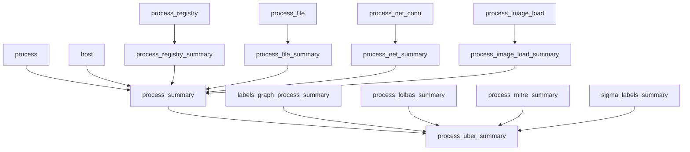

# Data Model and Dataset Layout Notes

## Current model layers

The current canonical implementation uses DBT model layers over `raw_sensor` parquet:

| Layer | Physical form today | Purpose |
| --- | --- | --- |
| Sensor output | on-host parquet and `raw_sensor` parquet | Durable raw telemetry materialized by Wintap/Lintap. |
| DBT bronze | DuckDB or Spark tables/views from `models/bronze` | Raw-source compatibility, typed empty optional inputs, stable raw columns. |
| DBT silver | DuckDB or Spark tables/views from `models/silver` | Normalized detail models for host, process, file, registry, network, image-load, and process path. |
| DBT gold | DuckDB or Spark tables/views from `models/gold` | Per-process summaries and `process_uber_summary`. |
| Monitoring | DuckDB/Spark views where enabled | Row-count sanity checks for built models. |

Historical filesystem layers still exist in older code/docs:

| Historical layer | DBT-era equivalent / status |
| --- | --- |
| `merged` | Deprecated. Do not use in normal pipeline. |
| `rolling` | Superseded by DBT bronze/silver for new work. |
| `stdview-*` / `stdview` | Superseded by DBT silver/gold DuckDB output for current work; parquet export may recreate this shape later. |
| enriched/gold parquet | Superseded by DBT gold DuckDB output for current work; enrichment wiring and export remain future work. |

## Canonical raw sensor directory conventions

```text
<dataset>/raw_sensor/<event_type>/dayPK=YYYYMMDD/hourPK=HH/<file>.parquet
<dataset>/raw_sensor/raw_process_conn_incr/dayPK=YYYYMMDD/hourPK=HH/protoPK=tcp/<file>.parquet
<dataset>/raw_sensor/raw_process_conn_incr/dayPK=YYYYMMDD/hourPK=HH/protoPK=udp/<file>.parquet
```

Partition semantics:

- `dayPK`: UTC data-capture date.
- `hourPK`: UTC data-capture hour.
- `protoPK`: protocol partition for network increments.

DBT now assumes new canonical data and expects `protoPK=` for network partitions.

## Core raw event types

Common raw event types referenced by DBT:

| Raw event type | Notes |
| --- | --- |
| `raw_host` | Host metadata. `.NET` now emits the canonical name instead of `raw_host_sensor`. |
| `raw_macip` | Host/interface IP metadata. `.NET` now emits the canonical name instead of `raw_macip_sensor`. |
| `raw_process` | Process start/refresh/stop events. |
| `raw_process_conn_incr` | Network activity increments. TCP/UDP are stored together with a `protoPK` protocol partition. |
| `raw_process_file` | File activity. |
| `raw_process_registry` | Registry activity. Optional in current DBT. |
| `raw_imageload` | DLL/image-load activity. Optional in current DBT. |

Known stale aliases that should not be emitted by new sources:

| Stale alias | Canonical event |
| --- | --- |
| `raw_host_sensor` | `raw_host` |
| `raw_macip_sensor` | `raw_macip` |
| `raw_file` | `raw_process_file` |
| `raw_processstop` | `raw_process` |
| `raw_registry` | `raw_process_registry` |

## DBT bronze models

Bronze models expose stable staging relations:

- `stg_raw_host`
- `stg_raw_macip`
- `stg_raw_process`
- `stg_raw_process_conn_incr`
- `stg_raw_process_file`
- `stg_raw_process_registry`
- `stg_raw_imageload`

Bronze owns raw schema drift and optional input handling. Examples:

- missing `ProcessArgs` can be synthesized from `CommandLine`,
- missing `UniqueProcessKey` can be synthesized as `NULL`,
- missing registry/image-load parquet can produce typed empty relations,
- Spark/S3 partial datasets can be described with `WINTAP_DBT_AVAILABLE_RAW_EVENTS` so optional missing paths are not read.

## Spark/S3 model validation status

The POC model `poc_s3_raw_process` currently passes against:

```text
s3a://ilum-data/lintap/raw_sensor
sc://spark.acme.dev:15002
```

Next validation target is all available Bronze/Silver/Gold models with:

```sh
export WINTAP_DBT_AVAILABLE_RAW_EVENTS=raw_host,raw_process,raw_macip,raw_process_conn_incr,raw_process_file
```

Known likely model-layer issues are remaining `group by all`, recursive `process_path`, optional missing registry/image-load inputs, and Linux/Windows schema drift.

## DBT silver detail models

Silver models are normalized/detail objects:

- `host`
- `host_ip`
- `process`
- `process_conn_incr`
- `process_net_conn`
- `process_file`
- `process_registry`
- `process_image_load`
- `process_exe_file_summary`
- `files_tmp_v1`
- `files`
- `all_files`
- `process_path`

The model is process-centric. `pid_hash` is the primary process entity key used by downstream summaries and labels.

## DBT gold summary flow



`process_summary` includes:

- process metadata: name, args, path, hashes, parent PID hash, user, timing,
- process stop metrics: CPU, IO, memory/commit, exit code where present,
- registry counts and first/last seen,
- file counts/bytes and first/last seen,
- network counts/bytes/ratios and first/last seen,
- DLL/image-load lists/counts,
- host OS/version/architecture context.

`process_uber_summary` is the broad feature table referenced by workshop docs. Today, optional enrichment components are typed empty DBT stubs until real inputs are wired in.

## Important time semantics

There are multiple time domains:

- Windows FileTime in many raw Wintap fields and legacy filenames.
- Unix epoch seconds after conversion by DuckDB macros/Python helpers.
- Upload time partitions (`uploadedDPK`, `uploadedHPK`) in S3 workflows.
- Data capture time partitions (`dayPK`, `hourPK`) locally.

Downstream local partitions should represent **capture time**, not upload time.

## DuckDB conventions

Raw parquet scans rely on DuckDB capabilities such as:

```sql
read_parquet('<glob>', hive_partitioning = true, union_by_name = true)
```

`union_by_name=true` is important because raw parquet schemas may evolve or differ between files.
